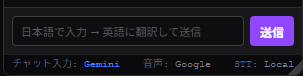

# Twitch Chat Translator

[日本語](README.md) | [English](README.en.md) | [Русский](README.ru.md)


📖 **For detailed usage, FAQ, and troubleshooting, see the [Wiki](https://github.com/KAWAchan-jp/twitch-chat-translate-ext/wiki)**.

**A Chrome extension that removes the language barrier from Twitch**

| | |
|---|---|
| 💬 **Translate chat in real time** | Instantly translate fast-moving chat into Japanese and enjoy foreign-language streams together with the chat |
| 🎙️ **Show streamer speech as subtitles** | Automatically recognize stream audio and display real-time subtitles. No API key required; all processing is local |
| ✏️ **Join chat in Japanese** | Type in Japanese and send automatically translated messages, even when the streamer uses another language |
| 🤖 **Gemini AI translation** | Use Gemini AI for voice subtitles and sent-message translation. It produces natural translations for game terms and slang |

---

## Features

### Chat Translation

- **Real-time translation** — Automatically translates messages as they arrive using Google Translate or DeepL, with three-way parallel processing.
- **High-speed chat mode** — When chat is moving quickly (3 messages/sec or more), translation is automatically reduced and original messages are shown. Pause scrolling or hover to translate only the visible range and save API usage.
- **Translation engine display** — The header always shows the translation direction and engine, such as `JA→JA・Google`. It turns orange when channel-specific settings are active.
- **Footer translation engine indicators** — The panel footer always shows the translation engine used for your own messages and voice subtitles (Google / DeepL / Gemini).
- **Automatic stream language detection** — Reads Twitch tags and automatically sets the source language.
- **Floating panel** — Stays in the lower-right corner of the page. Drag the header to move it, drag the lower-right handle to resize it, and adjust opacity.
- **Automatic channel detection** — Detects the channel from the URL and supports Twitch SPA navigation.
- **Per-channel language settings** — Remembers source and target languages per channel and switches automatically.
- **Scroll pause** — Scrolling upward pauses auto-scroll and shows a “↓ Latest” button.
- **Translation cache** — Reuses cached results for identical text to save DeepL character usage.
- **Translate and send** — After logging in to Twitch, send translated messages from the panel input field.
- **Minimum length filter** — Skips short taunts or emote-like strings. The character count can be adjusted.
- **Same-language filter** — Skips messages already written in the target language.

### Gemini AI Translation

- **Gemini 2.0 Flash** — Uses Gemini AI for voice subtitles and sent-message translation, producing natural translations for game terms and slang.
- **Per-feature selection** — Turn Gemini on/off separately for voice subtitles and sent messages. Chat translation remains Google / DeepL because chat volume is high and Google is recommended.
- **Prompt editing** — Freely customize the translation prompt from the options page. `{lang}` is replaced with the target language and `{text}` with the recognized text.
- **Fallback** — If Gemini is disabled or fails, the extension automatically falls back in order: DeepL → Google Translate.
- **Free tier** — 1,500 requests/day and 15 requests/minute. Get an API key from Google AI Studio.

### Voice Subtitles (Local Whisper)

- **No API key required** — Runs Whisper locally inside the extension using Transformers.js v3 and ONNX Runtime.
- **Japanese-specialized model support** — Kotoba-Whisper v2.2, including standard and lightweight versions, greatly improves Japanese recognition accuracy.
- **WebGPU support** — Uses WebGPU automatically for fast inference when available. Falls back to CPU (WASM) when unavailable.
- **No tab-sharing banner** — Captures audio directly from the `<video>` element with the Web Audio API.
- **VAD (silence detection)** — Starts processing immediately after speech ends for low latency.
- **Parallel worker processing** — Runs inference with multiple Web Workers (up to 8 on CPU; 1 worker on GPU to reduce video stutter).
- **Context carryover** — Passes recent utterances as prompts to keep recognition context.
- **Manual model download** — Download or delete each model individually from the options page.
- **Hallucination countermeasures** — Automatically removes Whisper-specific repetitions, silence annotations, and common boilerplate. Custom exclusion patterns can also be registered.
- **Recognition hints (two layers)** — Improve recognition with “default hints” in options and temporary hints from the panel 💡. When empty, the streamer name and game name are used automatically.
- **Subtitle overlay** — Shows subtitles over the stream. The overlay can be dragged to any position.

---

## Requirements

- **Chrome** latest version with Manifest V3 support.
- **WebGPU**: A WebGPU-capable GPU is required to comfortably use Small or larger models.
  - RTX 20 series or later, RX 6000 series or later, etc.
  - Environments without GPU support still work on CPU (WASM), but more slowly.
- **Available VRAM** when using GPU:

| Model | Required free VRAM |
|-------|--------------------|
| Tiny / Base | Not required (CPU recommended) |
| Small | 1 GB or more |
| Kotoba-Whisper v2.2 lightweight | 1.5 GB or more |
| Medium | 2 GB or more |
| Large-v3-Turbo | 3 GB or more |
| Kotoba-Whisper v2.2 | 3 GB or more |

---

## Installation

1. Download this repository as a ZIP file, or run `git clone`.
2. Open `chrome://extensions/` in Chrome.
3. Turn on **Developer mode** in the upper-right corner.
4. Click **Load unpacked** and select the downloaded folder.
5. Click the puzzle icon (🧩) in the toolbar and pin **Twitch Chat Translator**.

---

## Setup (Voice Subtitles)

Before using voice subtitles, download a model from the options page.

1. Right-click the extension icon and open **Options**.
2. Press **Download** for the model you want to use.
3. Check the download progress bar and wait for completion.
4. When it shows “Downloaded ✓”, setup is complete.
5. Open a Twitch page and start speech recognition with the panel **🎤 button**.

> **First-launch note:** Large models such as Large-v3-Turbo compile GPU shaders the first time they are started on a Twitch page. This may take several minutes. It is normal for the panel to show “Initializing GPU shaders...”. Later launches are much faster.

---

## Usage

### Panel Header


| Display | Description |
|---------|-------------|
| ● Status dot | Chat connection status: green = connected, blinking yellow = connecting, pink = disconnected/stopped |
| **#channel name** | Connected channel. The game being played is also shown on the right |
| **EN→JA・Google** | Translation direction and engine. **Orange** means channel-specific language settings are saved |
| Number such as 0.5.3.8 | Extension version |
| **💡** | Opens/closes the recognition hint input bar |
| **🎤** | Toggles voice subtitles on/off |
| **×** | Closes the panel and stops chat receiving/translation |

**💡 Recognition hint bar**  
Edit hints passed to Whisper on the spot. Add proper nouns such as streamer names, character names, or technical terms separated by spaces to improve recognition accuracy. Input is saved automatically and applied from the next utterance. Update it quickly when the topic changes.

### Panel Footer



The panel footer shows the currently used translation engines in real time.

| Display | Description |
|---------|-------------|
| **Chat:** | Translation engine for messages you type and send (Google / <span style="color:#00c4a0">DeepL</span>) |
| **Voice:** | Translation engine for recognized streamer speech (Google / <span style="color:#00c4a0">DeepL</span> / <span style="color:#4285f4">Gemini</span>) |

Changes made on the options page are reflected in the footer in real time.

| Action | Behavior |
|--------|----------|
| Click the icon | Toggle the panel on/off |
| Right-click the icon | Change source/target languages and display settings |
| Drag the panel header | Move the panel |
| Drag the lower-right handle | Resize the panel |
| Scroll upward in the panel | Pause auto-scroll |
| “↓ Latest” button | Move to the bottom and resume auto-scroll |

Language settings are saved per channel. They switch automatically when you move to another channel.

### Sending Chat

1. Right-click the icon and set the source language.
2. Click **Log in with Twitch** in the panel.
3. After logging in, type in Japanese in the input field at the bottom of the panel and send.
4. The message is translated automatically and posted to the channel.

### Voice Subtitles

1. Click the **🎤 button** in the panel header.
2. The extension recognizes stream audio automatically and displays subtitles.
3. Drag the subtitle window to your preferred position.

> The recognition language follows the channel source-language setting. If it is set to `Auto detect`, Whisper detects the language automatically.

---

## Whisper Models

| Model | Size | Free VRAM | Accuracy | Recommended environment |
|-------|------|-----------|----------|--------------------------|
| Tiny | About 38 MB | Not required | Standard | CPU / low-spec |
| Base | About 74 MB | Not required | Higher | CPU |
| Small | About 244 MB | 1 GB+ | High | GPU recommended |
| Medium | About 769 MB | 2 GB+ | Best | GPU required |
| Large-v3-Turbo | About 809 MB | 3 GB+ | Best and fast | GPU required |
| Kotoba-Whisper v2.2 ⭐ | About 1.5 GB | 3 GB+ | Best (Japanese-specialized) | GPU required; recommended for Japanese |
| Kotoba-Whisper v2.2 lightweight ⭐ | About 530 MB | 1.5 GB+ | High (Japanese-specialized) | GPU recommended; lighter load; recommended for Japanese |

> **Model selection guide:**  
> 1. First-time users should start with **Small**, a lightweight multilingual all-rounder.  
> 2. If you mainly watch Japanese streams, step up to **Kotoba-Whisper lightweight** for much better Japanese recognition.  
> 3. If you do not have a GPU, use **Tiny / Base** on CPU.

---

## Options

Open options by right-clicking the extension icon and choosing **Options**.

| Setting | Description |
|---------|-------------|
| **Recognition model** | Download, delete, and select models. Changes apply automatically from the next utterance |
| **Default recognition hints** | Always-on hints for all channels. These are combined before the temporary panel 💡 hints |
| **Subtitle font size** | Voice subtitle text size (14-56 px) |
| **Enable DeepL** | Use DeepL instead of Google Translate |
| **DeepL feature selection** | Toggle DeepL separately for chat translation, voice subtitles, and sent messages |
| **DeepL API key** | Supports both free keys ending in `:fx` and paid keys |
| **Enable Gemini** | Enables Gemini 2.0 Flash. Per-feature toggles let you choose voice subtitles and sent messages separately |
| **Gemini API key** | Get one from Google AI Studio. Free tier: 1,500 requests/day and 15 requests/minute |
| **Gemini prompt** | Customize translation instructions. `{lang}` = target language, `{text}` = recognized text |
| **Default target language** | Target language used when no channel-specific setting exists |
| **Same-language filter** | Skip messages already in the target language |
| **Minimum length filter** | Skip messages shorter than the specified character count |
| **VAD silence threshold** | Speech detection sensitivity. Lower values are more sensitive. Default: 10% |
| **VAD silence duration** | Wait time from speech end to processing start. Default: 500 ms |
| **Beam count** | Accuracy vs speed balance: 1 = faster, 3 = more accurate |
| **Parallel worker count** | Number of simultaneous inference workers. Default: 4; automatically reduced to 1 when GPU is detected |
| **Maximum chunk length** | Forced processing interval when silence is not detected. Default: 5 seconds |
| **Panel opacity** | Panel background opacity: 30-100%, default 80%. The panel becomes opaque on hover |
| **Hallucination exclusion patterns** | Register Whisper misgeneration phrases to remove them from subtitles automatically |

> The DeepL free tier allows 500,000 characters per month. The Gemini free tier allows 1,500 requests/day and 15 requests/minute. Use per-feature toggles to enable them only where needed.

---

## File Structure

```text
twitch-chat-translate-ext/
├── manifest.json           # Extension settings (Manifest V3)
├── background.js           # Service Worker (translation API proxy, cache, OAuth)
├── content.js              # Content script main (constants, state, initialization, settings)
├── content-panel.js        # Content script (Shadow DOM panel and UI)
├── content-chat.js         # Content script (IRC, chat translation, high-speed chat)
├── content-whisper.js      # Content script (Whisper speech recognition and subtitles)
├── whisper-worker.js       # Whisper inference script running in Web Workers
├── auth-callback.js        # Content script for OAuth callback
├── help.html               # Usage page (right-click icon → “📖 Help”)
├── options.html / options.js / options.css
├── docs/images/            # Documentation images
├── lib/
│   ├── transformers.min.js               # Transformers.js v3 (Whisper inference engine)
│   ├── ort-wasm-simd-threaded.jsep.wasm  # ONNX Runtime (WebGPU support)
│   ├── ort-wasm-simd-threaded.jsep.mjs   # ONNX Runtime (WebGPU support)
│   ├── ort-wasm-simd.wasm                # ONNX Runtime WASM (SIMD support)
│   └── ort-wasm.wasm                     # ONNX Runtime WASM (fallback)
└── icons/
```

---

## Technical Details

### Translation

Direct `fetch` requests to `translate.googleapis.com` are blocked by CORS, so requests are routed from `content.js` through `background.js` (Service Worker).

Translation engine priority: **Gemini → DeepL → Google**. Higher-priority engines are used when enabled, and the extension automatically falls back on errors.
Chat translation supports Google / DeepL only because chat volume is high and Gemini is not recommended for it. Voice subtitles and sent messages can also use Gemini.
Results for identical text and language pairs are stored in an in-memory LRU cache to skip repeated translations.

### Chat Receiving and Sending

The extension connects directly to Twitch IRC over WebSocket: `wss://irc-ws.chat.twitch.tv:443`.

- Not logged in: read-only connection as an anonymous `justinfan` user.
- Logged in: authenticates with an OAuth token and sends messages using the `PRIVMSG` command.

### Voice Subtitles

**Capture:**  
Instead of `getDisplayMedia()` (tab sharing, which shows a banner), the extension uses the Web Audio API. It taps audio directly from the Twitch `<video>` element with `AudioContext.createMediaElementSource(<video>)`.

**Inference:**  
[Transformers.js](https://github.com/huggingface/transformers.js) v3 + ONNX Runtime Web run inside Web Workers. When GPU is available, WebGPU-optimized `onnx-community` models are used (fp16 encoder + q4 decoder; q4f16 for lightweight models). If GPU is unavailable, the extension automatically falls back to WASM models (q8 encoder + q4 decoder).

**WebGPU shader compilation:**  
On first launch, ONNX Runtime compiles GPU shaders. Larger models take longer. Compiled shaders are cached in Chrome IndexedDB, so later launches are faster.

**VAD (Voice Activity Detection):**  
An `AnalyserNode` monitors volume level and starts processing when the configured silence duration continues after speech. Parallel workers reduce lag during continuous speech.

**Hallucination countermeasures:**  
Whisper-specific bad outputs, including boilerplate phrases, non-speech annotations, repeated text, and symbol-only output, are detected and removed automatically.

### OAuth

Twitch Implicit Grant flow is used.

1. The extension opens `id.twitch.tv/oauth2/authorize` in a new tab.
2. After authentication, Twitch redirects to `kawachan-jp.github.io/twitch-chat-translate/`.
3. `auth-callback.js`, injected into that page, reads the token from the URL fragment and forwards it to `background.js`.

### Panel

The panel uses Shadow DOM to isolate it from page CSS: `attachShadow({ mode: 'open' })`.

---

## Default Settings

| Setting | Default |
|---------|---------|
| Source language | Auto detect |
| Target language | Japanese |
| Show original text | ON |
| Auto-scroll | ON |
| Use DeepL | OFF |
| Use Gemini | OFF |
| Same-language filter | OFF |
| Minimum length filter | OFF (4 characters) |
| VAD silence threshold | 10% |
| VAD silence duration | 500 ms |
| Beam count | 1 (fast) |
| Parallel worker count | 4 (1 when GPU is detected) |
| Maximum chunk length | 5 seconds |
| Whisper model | Tiny |
| Subtitle font size | 22 px |
| Panel opacity | 80% |

---

## Feature Requests and Improvements

Issues and pull requests are welcome. Feel free to suggest features that would make the extension more useful.

---

## License

[MIT License](LICENSE)
