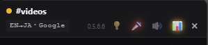

# Twitch Chat Translator


**Twitch の言葉の壁をなくす Chrome 拡張**

| | |
|---|---|
| 💬 **チャットをリアルタイム翻訳** | 流れるチャットを即座に日本語へ。外国語配信もチャットごと楽しめる |
| 🎙️ **配信者の声を字幕表示** | 配信音声を自動認識してリアルタイム字幕。APIキー不要・完全ローカル処理 |
| ✏️ **日本語でチャットに参加** | 日本語で入力すると自動翻訳して送信。言語が違っても配信者と話せる |

---

## 機能

### チャット翻訳
- **リアルタイム翻訳** — チャットが流れるたびに自動翻訳（Google Translate / DeepL）・3並列処理
- **弾幕モード** — チャットの流速が速いとき（3msg/秒以上）は自動で翻訳を控えて原文表示。スクロールを止める・ホバーで見えている範囲だけ翻訳（API消費を節約）
- **翻訳エンジン表示** — ヘッダーに `JA→JA・Google` のように翻訳方向と使用エンジンを常時表示。チャンネル別設定があるときはオレンジ色
- **配信言語の自動検出** — Twitch のタグから配信言語を取得して翻訳元言語に自動設定
- **フローティングパネル** — ページ右下に常駐。ヘッダーのドラッグで移動、右下のツマミでリサイズ、透過率調整も可能
- **チャンネル自動検出** — URL からチャンネルを自動取得。SPA ナビゲーションにも対応
- **チャンネル別言語設定** — チャンネルごとに翻訳元・翻訳先を記憶して自動切り替え
- **スクロール一時停止** — 上にスクロールすると自動スクロールが止まり「↓ 最新へ」ボタンが出現
- **翻訳キャッシュ** — 同一テキストはキャッシュから即返却（DeepL の使用文字数を節約）
- **翻訳して送信** — Twitch ログイン後、パネルの入力欄から翻訳済みメッセージを送信
- **最小文字数フィルター** — 短い煽り・スタンプ文字列をスキップ（文字数は調整可能）
- **同一言語フィルター** — 翻訳先と同じ言語のメッセージをスキップ

### 音声字幕（ローカル Whisper）
- **APIキー不要** — Whisper を拡張機能内でローカル実行（Transformers.js v3 + ONNX Runtime）
- **日本語特化モデル対応** — Kotoba-Whisper v2.2（通常版・軽量版）で日本語認識率が大幅向上
- **WebGPU 対応** — GPU が使用可能な環境では自動的に WebGPU で高速推論。使用不可の場合は CPU（WASM）に自動フォールバック
- **タブ共有バナーなし** — Web Audio API で `<video>` 要素から直接音声を取得
- **VAD（無音検出）** — 発話終了後に即座に処理開始（低遅延）
- **並列ワーカー処理** — 複数の Web Worker で同時推論（CPU 時最大8並列・GPU 時は1ワーカーで映像のカクつきを防止）
- **コンテキスト引き継ぎ** — 直近の発話をプロンプトとして渡し、文脈を維持した認識
- **手動モデルダウンロード** — オプションページからモデルごとに個別ダウンロード・削除
- **ハルシネーション対策** — Whisper 特有の繰り返し・無音アノテーション・決まり文句を自動除去。カスタム除外パターンも登録可能
- **認識ヒント（2層）** — オプションの「デフォルトヒント」（常時有効）とパネル💡の「一時ヒント」（チャンネル移動でリセット）で認識精度を向上。未入力時は配信者名・ゲーム名を自動使用
- **字幕オーバーレイ** — 配信画面上に字幕を表示。ドラッグで位置調整可能

---

## 動作要件

- **Chrome** 最新版（Manifest V3 対応）
- **WebGPU**：Small 以上のモデルを快適に使用するには WebGPU 対応の GPU が必要
  - RTX 20 シリーズ以降、RX 6000 シリーズ以降など
  - GPU 非対応の環境でも CPU（WASM）で動作（低速）
- **利用可能な VRAM**（GPU 使用時）

| モデル | 必要な空き VRAM |
|-------|--------------|
| Tiny / Base | 不要（CPU 推奨） |
| Small | 1GB 以上 |
| Kotoba-Whisper v2.2 軽量版 | 1.5GB 以上 |
| Medium | 2GB 以上 |
| Large-v3-Turbo | 3GB 以上 |
| Kotoba-Whisper v2.2 | 3GB 以上 |

---

## インストール

1. このリポジトリを ZIP でダウンロード、または `git clone`
2. Chrome で `chrome://extensions/` を開く
3. 右上の **デベロッパーモード** を ON にする
4. **「パッケージ化されていない拡張機能を読み込む」** → ダウンロードしたフォルダを選択
5. ツールバーのパズルアイコン（🧩）→ **Twitch Chat Translator** をピン留め

---

## セットアップ（音声字幕）

音声字幕を使用する前に、オプションページからモデルをダウンロードする必要があります。

1. 拡張機能アイコンを右クリック → **「オプション」**
2. 使用したいモデルの **「ダウンロード」** ボタンを押す
3. 進捗バーでダウンロード状況を確認（完了まで待つ）
4. 「ダウンロード済み ✓」になったら準備完了
5. Twitch ページを開き、パネルの **🎤 ボタン** で音声認識を開始

> **初回起動時の注意：** Large-v3-Turbo など大きいモデルは、Twitch ページでの初回起動時に GPU シェーダーのコンパイルが行われます（数分かかる場合あり）。パネルに「GPU シェーダー初期化中...」と表示されている間は正常です。2回目以降は高速に起動します。

---

## 使い方

### パネルヘッダーの見方



| 表示 | 説明 |
|------|------|
| ● ステータスドット | チャット接続状態（緑＝接続中、黄点滅＝接続処理中、ピンク＝切断・停止） |
| **#チャンネル名** | 接続中のチャンネル。右側にプレイ中のゲーム名も表示 |
| **EN→JA・Google** | 翻訳方向と使用エンジン。**オレンジ色**のときはこのチャンネル専用の言語設定が保存されています |
| 数字（0.5.3.8 など） | 拡張機能のバージョン |
| **💡** | 認識ヒント入力バーの開閉 |
| **🎤** | 音声字幕の ON / OFF |
| **×** | パネルを閉じる（チャット受信・翻訳も停止） |

**💡 認識ヒントバー**（画像下部の入力欄）
音声認識（Whisper）に渡すヒントをその場で編集できます。配信者名・ゲームのキャラ名・専門用語などの固有名詞をスペース区切りで入れると認識精度が上がります。入力は自動保存され、**次の発話から即反映**されます。話題が変わったらサッと書き換えるのがおすすめです。


| 操作 | 動作 |
|------|------|
| アイコンをクリック | パネルの表示 / 非表示を切り替え |
| アイコンを右クリック | 翻訳元・翻訳先言語の変更、表示設定 |
| パネルのヘッダーをドラッグ | パネルを移動 |
| パネル右下のツマミをドラッグ | パネルをリサイズ |
| パネルを上にスクロール | 自動スクロールを一時停止 |
| 「↓ 最新へ」ボタン | 最下部へ移動して自動スクロール再開 |

チャンネルごとに言語設定が保存されます。別チャンネルに移動すると自動で切り替わります。

### チャット送信

1. アイコンを右クリック → 翻訳元言語を設定
2. パネルの **「Twitchでログイン」** をクリック
3. ログイン後、パネル下部の入力欄に日本語で入力して送信
4. 自動翻訳されてチャンネルに投稿されます

### 音声字幕

1. パネルヘッダーの **🎤 ボタン** をクリック
2. ストリームの音声を自動認識して字幕表示
3. 字幕ウィンドウはドラッグで好きな位置に移動できます

> 認識言語はチャンネルの翻訳元言語設定に従います。`自動検出` の場合は Whisper が自動判定します。

---

## Whisper モデル一覧

| モデル | サイズ | 空きVRAM | 精度 | 推奨環境 |
|-------|-------|---------|------|---------|
| Tiny | 約38MB | 不要 | 標準 | CPU / 低スペック |
| Base | 約74MB | 不要 | 高め | CPU |
| Small | 約244MB | 1GB以上 | 高い | GPU推奨 |
| Medium | 約769MB | 2GB以上 | 最高 | GPU必須 |
| Large-v3-Turbo | 約809MB | 3GB以上 | 最高・高速 | GPU必須 |
| Kotoba-Whisper v2.2 ⭐ | 約1.5GB | 3GB以上 | 最高（日本語特化） | GPU必須・日本語おすすめ |
| Kotoba-Whisper v2.2 軽量版 ⭐ | 約530MB | 1.5GB以上 | 高い（日本語特化） | GPU推奨・低負荷・日本語おすすめ |

---

## オプション設定

拡張機能アイコンを右クリック → **「オプション」** から開きます。

| 設定項目 | 内容 |
|----------|------|
| **認識モデル** | モデルのダウンロード・削除・選択（変更は次の発話から自動反映） |
| **デフォルト認識ヒント** | 全チャンネルで常時有効なヒント。パネル💡の一時ヒントの前に結合される |
| **字幕フォントサイズ** | 音声字幕の文字サイズ（14〜56px） |
| **DeepL を有効にする** | Google Translate の代わりに DeepL を使用 |
| **DeepL 使用機能の選択** | チャット翻訳・音声字幕・送信メッセージを個別に ON/OFF |
| **DeepL API キー** | 無料版（末尾 `:fx`）・有料版どちらも対応 |
| **デフォルト翻訳先言語** | チャンネル別設定がない場合の翻訳先言語 |
| **同一言語フィルター** | 翻訳先と同じ言語のメッセージをスキップ |
| **最小文字数フィルター** | 指定文字数未満のメッセージをスキップ |
| **VAD 無音判定レベル** | 発話検出の感度（小さいほど敏感、デフォルト: 10%） |
| **VAD 無音継続時間** | 発話終了から処理開始までの待機時間（デフォルト: 500ms） |
| **ビーム数** | 精度 vs 速度のバランス（1: 高速 / 3: 高精度） |
| **並列ワーカー数** | 同時推論数（デフォルト: 4。GPU 検出時は自動的に1に削減） |
| **チャンク最大長** | 無音未検出時の強制処理時間（デフォルト: 5秒） |
| **パネル透過率** | パネルの背景透過率（30〜100%、デフォルト: 80%。ホバーで不透明） |
| **ハルシネーション除外パターン** | Whisper の誤生成フレーズを登録して字幕から自動除外 |

> DeepL 無料枠は 50万文字/月。機能別トグルで必要な箇所だけ有効にすることで節約できます。

---

## ファイル構成

```
twitch-chat-translate-ext/
├── manifest.json           # 拡張の設定（Manifest V3）
├── background.js           # Service Worker（翻訳APIプロキシ、キャッシュ、OAuth）
├── content.js              # コンテンツスクリプト（パネル、IRC、音声録音、VAD）
├── whisper-worker.js       # Web Worker で動作する Whisper 推論スクリプト
├── auth-callback.js        # OAuth コールバック用コンテンツスクリプト
├── help.html               # 使い方ページ（アイコン右クリック →「📖 使い方」）
├── options.html / options.js / options.css
├── docs/images/            # ドキュメント用画像
├── lib/
│   ├── transformers.min.js             # Transformers.js v3（Whisper 推論エンジン）
│   ├── ort-wasm-simd-threaded.jsep.wasm  # ONNX Runtime（WebGPU対応）
│   ├── ort-wasm-simd-threaded.jsep.mjs   # ONNX Runtime（WebGPU対応）
│   ├── ort-wasm-simd.wasm              # ONNX Runtime WASM（SIMD対応）
│   └── ort-wasm.wasm                   # ONNX Runtime WASM（フォールバック）
└── icons/
```

---

## 技術的な詳細

### 翻訳

`translate.googleapis.com` への直接 fetch は CORS で弾かれるため、  
content.js → background.js（Service Worker）経由でリクエストしています。

DeepL が有効な場合は DeepL API を優先し、エラー時は自動的に Google Translate にフォールバックします。  
同一テキスト・言語ペアの結果はメモリ上のキャッシュ（LRU 方式）に保存され、再翻訳をスキップします。

### チャット受信・送信

Twitch IRC over WebSocket（`wss://irc-ws.chat.twitch.tv:443`）に直接接続します。

- 未ログイン時：`justinfan` の匿名ユーザーで読み取り専用接続
- ログイン時：OAuth トークンで認証し、`PRIVMSG` コマンドで送信

### 音声字幕

**キャプチャ：**  
`getDisplayMedia()`（タブ共有、バナーが出る）の代わりに Web Audio API を使用。  
`AudioContext.createMediaElementSource(<video>)` で Twitch の `<video>` 要素から直接音声をタップします。

**推論：**  
[Transformers.js](https://github.com/huggingface/transformers.js) v3 + ONNX Runtime Web を Web Worker 上で実行。  
GPU が利用可能な場合は `onnx-community` の WebGPU 最適化モデル（fp16 エンコーダ + q4 デコーダ、軽量版は q4f16）を使用。  
GPU が使用不可の場合は WASM モデル（q8 エンコーダ + q4 デコーダ）に自動フォールバック。

**WebGPU シェーダーコンパイル：**  
初回起動時、ONNX Runtime が GPU シェーダーをコンパイルします（モデルが大きいほど時間がかかる）。  
コンパイル済みシェーダーは Chrome が IndexedDB にキャッシュするため、2回目以降は高速に起動します。

**VAD（Voice Activity Detection）：**  
`AnalyserNode` で音量レベルを監視し、発話後に設定した無音時間が続いた時点で処理を開始。  
並列ワーカー構成で連続発話時のラグを低減。

**ハルシネーション対策：**  
Whisper 特有の誤出力（決まり文句・非音声アノテーション・繰り返し・記号のみ）を自動検出して除去。

### OAuth

Twitch の Implicit Grant フローを使用します。

1. 拡張が `id.twitch.tv/oauth2/authorize` を新しいタブで開く
2. 認証後、`kawachan-jp.github.io/twitch-chat-translate/` にリダイレクト
3. そのページに注入した `auth-callback.js` が URL フラグメントからトークンを取得し background.js に転送

### パネル

Shadow DOM でページの CSS から分離しています（`attachShadow({ mode: 'open' })`）。

---

## 設定のデフォルト値

| 設定 | デフォルト |
|------|-----------|
| 翻訳元言語 | 自動検出 |
| 翻訳先言語 | 日本語 |
| 原文を表示 | ON |
| 自動スクロール | ON |
| DeepL を使用 | OFF |
| 同一言語フィルター | OFF |
| 最小文字数フィルター | OFF（4文字） |
| VAD 無音判定レベル | 10% |
| VAD 無音継続時間 | 500ms |
| ビーム数 | 1（高速） |
| 並列ワーカー数 | 4（GPU 検出時は 1） |
| チャンク最大長 | 5秒 |
| Whisper モデル | Tiny |
| 字幕フォントサイズ | 22px |
| パネル透過率 | 80% |

---

## 機能要望・改善提案

Issue や Pull Request を歓迎します。  
「こんな機能があったら便利」という要望も気軽にどうぞ。
