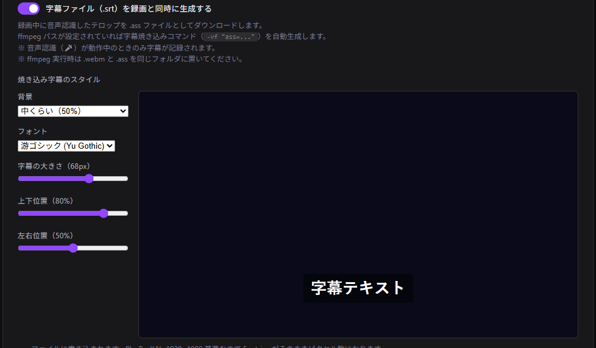

# Twitch Chat Translator

[日本語](README.md) | [English](README.en.md) | [Русский](README.ru.md)


📖 **詳しい使い方・FAQ・トラブルシューティングは [Wiki](https://github.com/KAWAchan-jp/twitch-chat-translate-ext/wiki) へ**（English overview available）

**Twitch の言葉の壁をなくす Chrome 拡張**

> *「サン・バベル」*（Sans Babel）— フランス語で「バベルなし」を意味します。
> 聖書の創世記によれば、バベルの塔が建てられたことにより神が人々の言語を混乱させ、言葉の壁が生まれたとされています。
> この拡張機能はその壁を取り除くために作られました。

| | |
|---|---|
| 💬 **チャットをリアルタイム翻訳** | 流れるチャットを即座に日本語へ。外国語配信もチャットごと楽しめる |
| 🎙️ **配信者の声を字幕表示** | 配信音声を自動認識してリアルタイム字幕。Faster-Whisper（ローカルサーバー）または Groq API を使用 |
| ✏️ **日本語でチャットに参加** | 日本語で入力すると自動翻訳して送信。言語が違っても配信者と話せる |
| 🤖 **Gemini AI 翻訳** | 音声字幕・送信メッセージの翻訳に Gemini AI を使用。ゲーム用語・スラングにも強い自然な翻訳 |
| 🖥️ **Faster-Whisper STT** | ローカルサーバー経由で Whisper large 系モデルを利用。PC の GPU で高精度・低遅延認識（GPU 搭載前提） |
| ⚡ **Groq Whisper STT** | クラウド音声認識で高精度・高速な字幕 |
| 🔊 **翻訳読み上げ（TTS）** | 翻訳した字幕を自動読み上げ。配信者の声を理解しながら聴ける |
| 📊 **API 利用状況パネル** | Gemini・Groq・DeepL の利用量をリアルタイム表示。使いすぎ防止に |
| 🎬 **クリップ録画** | 配信画面を録画し、翻訳字幕入り動画として書き出し。ffmpeg で字幕を焼き込み可能 |

---

## 機能

### チャット翻訳
- **リアルタイム翻訳** — チャットが流れるたびに自動翻訳（Google Translate / DeepL）・3並列処理
- **弾幕モード** — チャットの流速が速いとき（3msg/秒以上）は自動で翻訳を控えて原文表示。スクロールを止める・ホバーで見えている範囲だけ翻訳（API消費を節約）
- **翻訳エンジン表示** — ヘッダーに `JA→JA・Google` のように翻訳方向と使用エンジンを常時表示。チャンネル別設定があるときはオレンジ色
- **フッター翻訳エンジンインジケーター** — パネル最下部に自分のメッセージ・音声字幕・STT エンジンをリアルタイム表示。クリックで有効化済みエンジンを巡回切替可能
- **配信言語の自動検出** — Twitch のタグから配信言語を取得して翻訳元言語に自動設定
- **フローティングパネル** — ページ右下に常駐。ヘッダーのドラッグで移動、右下のツマミでリサイズ、透過率調整も可能
- **チャンネル自動検出** — URL からチャンネルを自動取得。SPA ナビゲーションにも対応
- **チャンネル別言語設定** — チャンネルごとに翻訳元・翻訳先を記憶して自動切り替え
- **スクロール一時停止** — 上にスクロールすると自動スクロールが止まり「↓ 最新へ」ボタンが出現
- **翻訳キャッシュ** — 同一テキストはキャッシュから即返却（外部サービス利用時の使用文字数を節約）
- **翻訳して送信** — Twitch ログイン後、パネルの入力欄から翻訳済みメッセージを送信（DeepL・Gemini AI 利用可能）
- **最小文字数フィルター** — 短い煽り・スタンプ文字列をスキップ（文字数は調整可能）
- **同一言語フィルター** — 翻訳先と同じ言語のメッセージをスキップ

### Gemini AI 翻訳

- **モデル選択** — Gemini 2.5 Flash（推奨）/ 3.1 Flash Lite / 3 Flash / 3.5 Flash から選択可能
- **機能別選択** — 音声字幕・送信メッセージを個別に ON/OFF。チャット翻訳は Google / DeepL のまま（量が多いため Google 推奨）
- **プロンプト編集** — オプションページで翻訳プロンプトを自由にカスタマイズ可能。`{lang}` が翻訳先言語、`{text}` が認識テキストに置き換わる
- **フォールバック** — Gemini が無効または失敗した場合、DeepL → Google Translate の順に自動フォールバック
- **無料枠** — 1,500リクエスト/日・15リクエスト/分（Google AI Studio で APIキー取得）

### Groq Whisper STT（オプション）

- **クラウド音声認識** — Groq の高速推論基盤で Whisper Large-v3-Turbo / Large-v3 を実行
- **無料枠あり** — 月次リセット（$0.00/月の無料枠）。上限到達・エラー時は字幕にエラー表示されます
- **APIキー設定のみ** — オプションページで Groq APIキーを入力するだけで有効化

> Groq API キーは [console.groq.com](https://console.groq.com) で無料取得可能。

### Faster-Whisper STT（ローカルサーバー・GPU 搭載前提）

- **ローカルPCで高精度モデルを実行** — Faster-Whisper / CTranslate2 を使い、Large-v3 / Large-v3-Turbo などをローカルサーバー側で実行
- **ブラウザ外で推論** — Chrome 拡張内ではなく `http://127.0.0.1:8765/transcribe` などのローカルサーバーへ音声を送信
- **エラー時は字幕表示** — サーバー未起動・エラー・タイムアウト時は字幕にエラー表示されます（自動フォールバック先はありません）
- **サーバー同梱** — `uv/` に FastAPI ベースのサーバーを用意

> Faster-Whisper は「モデル名」ではなく、Whisper 系モデルを高速に動かす実行エンジンです。
> オプションページでは STT エンジンとして有効化し、使用モデル（例: Large-v3-Turbo）を別に選択します。

#### サーバーの起動（GPU / CUDA）

NVIDIA GPU 搭載 PC を前提とします。**CUDA Toolkit のインストールは不要**で、
[uv](https://docs.astral.sh/uv/) があれば1コマンドで起動できます
（CUDA 用ライブラリ cuBLAS / cuDNN は pip 版が自動ダウンロード・自動検出されます）:

```powershell
cd uv
uv run --with nvidia-cublas-cu12 --with "nvidia-cudnn-cu12>=9,<10" server.py
```

uv が未インストールの場合は、先に以下でインストールします。

```powershell
# Windows（PowerShell）
irm https://astral.sh/uv/install.ps1 | iex
```

```bash
# macOS / Linux
curl -LsSf https://astral.sh/uv/install.sh | sh
```

- 必要環境: NVIDIA GPU（VRAM 4GB 以上推奨）+ CUDA 12 対応ドライバー（バージョン 525 以上）
- 初回のみ cuBLAS / cuDNN（約1.2GB）とモデル本体（Large-v3-Turbo 約1.6GB）がダウンロードされます
- コンソールに `Model '...' ready` と表示されたら準備完了です
- CUDA が使えない環境では自動で CPU にフォールバックしますが、大型モデルは拡張のタイムアウト（30秒）に
  かかるため実用になりません（GPU 実測: 7.5秒音声を約0.5〜1秒で認識）

#### 使い方

1. 上記コマンドでサーバーを起動する（`Model '...' ready` が出るまで待つ）
2. 拡張のオプションページ →「Faster-Whisper」でチェックを ON にし、モデルを選択して保存
   （URL はデフォルトの `http://127.0.0.1:8765/transcribe` のままで OK）
3. Twitch ページでパネルのフッター「STT:」表示が <span style="color:#c084fc">Faster</span> になっていることを確認
   （Groq を有効にしている場合はクリックで Faster ↔ Groq を切替可能）
4. 🎤 で音声認識を開始すると、字幕が Faster-Whisper サーバーで認識されます

詳細（環境変数・API 仕様・性能実測・venv での起動方法）は
[uv/README.md](uv/README.md) を参照してください。

### 音声字幕の共通機能
- **タブ共有バナーなし** — Web Audio API で `<video>` 要素から直接音声を取得。音量が小さくても認識できますが、**音量0・ミュートでは無音になり認識できません**（タブのミュートは影響なし）
- **VAD（無音検出）** — 発話終了後に即座に処理開始（低遅延）
- **コンテキスト引き継ぎ** — 直近の発話をプロンプトとして渡し、文脈を維持した認識（Faster-Whisper のみ対応）
- **ハルシネーション対策** — Whisper 特有の繰り返し・無音アノテーション・決まり文句を自動除去。カスタム除外パターンも登録可能
- **認識ヒント（2層）** — オプションの「デフォルトヒント」（常時有効）とパネル💡の「一時ヒント」（チャンネル移動でリセット）で認識精度を向上。未入力時は配信者名・ゲーム名を自動使用
- **字幕オーバーレイ** — 配信画面上に字幕を表示。ドラッグで位置調整可能

### 翻訳読み上げ（TTS）

- **Web Speech API** — ブラウザ内蔵の音声合成エンジンで翻訳テキストを読み上げ
- **自動音声選択** — ニューラル音声（自然な発音）を優先し、なければ同言語の標準音声を自動選択
- **3段階フォールバック** — Natural/Online 音声 → 同言語音声 → 非対応言語はスキップ
- **速度調整** — オプションページで再生速度を調整可能（0.5〜2.0倍）
- **対応言語** — 日本語・英語・韓国語・中国語・スペイン語・フランス語・ドイツ語・ポルトガル語・ロシア語・アラビア語・ヒンディー語・タイ語・ベトナム語・インドネシア語

> Windows 11 ではニューラル音声（Nanami, Keita など）を追加インストールすると音質が向上します。
> 設定 → 時刻と言語 → 音声認識 → 音声の追加 から追加できます。

### クリップ録画

- **録画機能** — 配信画面を WebM 形式で録画（最大時間はオプションで設定可能）
- **ASS 字幕生成** — 録画中に認識・翻訳された字幕を `.ass` ファイルとして自動書き出し
- **字幕スタイル設定** — フォント・サイズ・位置（X/Y）・背景（なし/薄い/中/濃い/べた黒）をオプションページで調整
- **ffmpeg コマンド生成** — 字幕焼き込み用コマンドを自動生成。PowerShell / CMD / bash の形式で切り替え可能



---

## 動作要件

- **Chrome** 最新版（Manifest V3 対応）
- **音声字幕を使う場合**：Faster-Whisper ローカルサーバー（NVIDIA GPU・VRAM 4GB 以上推奨）または Groq API キーのいずれかが必要（詳細は各機能の節を参照）

---

## インストール

1. このリポジトリを ZIP でダウンロード、または `git clone`
2. Chrome で `chrome://extensions/` を開く
3. 右上の **デベロッパーモード** を ON にする
4. **「パッケージ化されていない拡張機能を読み込む」** → `extension/` フォルダを選択
5. ツールバーのパズルアイコン（🧩）→ **Twitch Chat Translator** をピン留め

---

## セットアップ（音声字幕）

音声字幕を使用するには、**Faster-Whisper ローカルサーバー**（上記「サーバーの起動」参照）または **Groq API キー**のいずれかをオプションページで有効化してください。どちらも未設定の場合、🎤 をオンにしても字幕は「音声認識エンジンが未設定」というエラー表示になります。

---

## 使い方

### パネルヘッダーの見方


| 表示 | 説明 |
|------|------|
| ● ステータスドット | チャット接続状態（緑＝接続中、黄点滅＝接続処理中、ピンク＝切断・停止） |
| **#チャンネル名** | 接続中のチャンネル。右側にプレイ中のゲーム名も表示 |
| **EN→JA・Google** | 翻訳方向と使用エンジン。**オレンジ色**のときはこのチャンネル専用の言語設定が保存されています |
| 数字（0.6.37 など） | 拡張機能のバージョン |
| **💡** | 認識ヒント入力バーの開閉 |
| **🎤** | 音声字幕の ON / OFF |
| **🔊** | 翻訳読み上げ（TTS）の ON / OFF |
| **📊** | API 利用状況パネルの表示 / 非表示 |
| **🔴** | クリップ録画パネルの開閉（録画中は赤く点滅） |
| **×** | パネルを閉じる（チャット受信・翻訳も停止） |

**💡 認識ヒントバー**（画像下部の入力欄）
音声認識（Whisper）に渡すヒントをその場で編集できます。配信者名・ゲームのキャラ名・専門用語などの固有名詞をスペース区切りで入れると認識精度が上がります。入力は自動保存され、**次の発話から即反映**されます。話題が変わったらサッと書き換えるのがおすすめです。


### パネルフッターの見方


パネル最下部のフッターに、現在使用中の翻訳エンジンをリアルタイムで表示します。

| 表示 | 説明 |
|------|------|
| **チャット入力:** | 自分が入力して送信するメッセージの翻訳エンジン（Google / <span style="color:#00c4a0">DeepL</span> / <span style="color:#4285f4">Gemini</span>）。</br><span style="color:#e84393">**⚠ 翻訳元言語が「自動検出」の場合は翻訳送信が無効になります**</span> |
| **音声:** | 配信者の音声認識後の翻訳エンジン（Google / <span style="color:#00c4a0">DeepL</span> / <span style="color:#4285f4">Gemini</span>） |
| **STT:** | 音声認識エンジン（<span style="color:#c084fc">Faster</span> = Faster-Whisper ローカルサーバー / <span style="color:#f0971d">Groq</span> = Groq Whisper API） |

オプションの設定変更はフッターにリアルタイム反映されます。**フッターの表示をクリックすると、有効化済みのエンジンを順番に切替できます**（チャット入力・音声は Google→DeepL→Gemini、STT は Faster→Groq。それぞれオプションで有効化していないエンジンは候補に出ません）。

| 操作 | 動作 |
|------|------|
| アイコンをクリック | パネルの表示 / 非表示を切り替え |
| アイコンを右クリック | 翻訳元・翻訳先言語の変更、表示設定 |
| パネルのヘッダーをドラッグ | パネルを移動 |
| パネル右下のツマミをドラッグ | パネルをリサイズ |
| パネルを上にスクロール | 自動スクロールを一時停止 |
| 「↓ 最新へ」ボタン | 最下部へ移動して自動スクロール再開 |

チャンネルごとに言語設定が保存されます。別チャンネルに移動すると自動で切り替わります。

### 利用状況パネル


ヘッダーの **📊** ボタンで開閉できる透過フローティングパネルです。Gemini・Groq・DeepL の API 利用量をリアルタイムで確認できます。

| 項目 | 説明 |
|------|------|
| **🤖 Gemini リクエスト** | 翻訳リクエスト回数 |
| **🤖 Gemini 入力/出力** | 送受信した文字数 |
| **⚡ Groq リクエスト** | 音声認識リクエスト回数 |
| **⚡ Groq 推定音声時間** | 認識した音声の合計時間（秒換算） |
| **🔵 DeepL リクエスト** | 翻訳リクエスト回数 |
| **🔵 DeepL 入力/出力** | 送受信した文字数 |

利用量はオプションページからリセットできます。パネルはドラッグで好きな位置に移動できます。

### 翻訳エンジンの切り替え

フッターの各項目をクリックすると、オプションで有効にしたエンジンをその場で切り替えられます。設定ページを開かずに素早く変更可能です。

| フッター項目 | クリックで切り替わるエンジン |
|---|---|
| **チャット入力:** | Google → DeepL → Gemini（有効なものだけ） |
| **音声:** | Google → DeepL → Gemini（有効なものだけ） |
| **STT:** | Faster → Groq（Groq は APIキー設定時のみ候補に出ます） |

> エンジンを使えるようにするにはオプションページで API キーを設定して有効化する必要があります。有効化していないエンジンはスキップされます。

### チャット送信

1. アイコンを右クリック → 翻訳元言語を設定
2. パネルの **「Twitchでログイン」** をクリック
3. ログイン後、パネル下部の入力欄に日本語で入力して送信
4. 自動翻訳されてチャンネルに投稿されます

### 音声字幕

1. パネルヘッダーの **🎤 ボタン** をクリック
2. ストリームの音声を自動認識して字幕表示
3. 字幕ウィンドウはドラッグで好きな位置に移動できます

> 認識言語はチャンネルの翻訳元言語設定に従います。`自動検出` の場合は Whisper が自動判定します。

### 翻訳読み上げ

1. パネルヘッダーの **🔊 ボタン** をクリックして ON にする
2. 配信者の音声が認識・翻訳されると自動で読み上げ
3. もう一度クリックで停止

> 配信者の音量を下げてもらうか、ヘッドホンで使用するのがおすすめです。

### クリップ録画

1. パネルヘッダーの **🔴 ボタン** をクリックして録画パネルを開く
2. **「● 録画開始」** をクリックすると録画が始まる（最大時間はオプションで設定可能、デフォルト 3 分）
3. 録画中は 🔴 が赤く点滅し、経過時間が表示される
4. **「■ 停止」** をクリックすると録画終了、`clip_チャンネル名_日時.webm` が自動ダウンロードされる
5. オプションで「字幕を録画に含める」が ON の場合、`.ass` 字幕ファイルも自動ダウンロードされる
6. 字幕焼き込み用の ffmpeg コマンドが自動生成されてクリップボードにコピーされる

> 🎤 音声字幕が動作中でないと字幕は記録されません。録画前に **🎤** をオンにしておくのがおすすめです。

---

## オプション設定

拡張機能アイコンを右クリック → **「オプション」** から開きます。

| 設定項目 | 内容 |
|----------|------|
| **デフォルト認識ヒント** | 全チャンネルで常時有効なヒント。パネル💡の一時ヒントの前に結合される（Faster-Whisper のみ対応） |
| **字幕フォントサイズ** | 音声字幕の文字サイズ（14〜56px） |
| **Faster-Whisper を有効にする** | ローカルサーバー（GPU）で音声認識。未起動・失敗時は字幕にエラー表示 |
| **Faster-Whisper サーバー URL** | `localhost` / `127.0.0.1` のみ指定可能。デフォルト `http://127.0.0.1:8765/transcribe` |
| **Faster-Whisper モデル** | Small / Medium / Large-v3 / Large-v3-Turbo（推奨）から選択 |
| **Groq STT を有効にする** | Groq Whisper API で音声認識。失敗時は字幕にエラー表示 |
| **Groq モデル** | Large-v3-Turbo（高速）または Large-v3（高精度）を選択 |
| **Groq API キー** | [console.groq.com](https://console.groq.com) で取得（無料） |
| **DeepL を有効にする** | Google Translate の代わりに DeepL を使用 |
| **DeepL 使用機能の選択** | チャット翻訳・音声字幕・送信メッセージを個別に ON/OFF |
| **DeepL API キー** | 無料版（末尾 `:fx`）・有料版どちらも対応 |
| **Gemini を有効にする** | Gemini AI を有効化。機能別トグルで音声字幕・送信メッセージを個別に選択 |
| **Gemini モデル** | 2.5 Flash（推奨）/ 3.1 Flash Lite / 3 Flash / 3.5 Flash |
| **Gemini API キー** | Google AI Studio で取得。無料枠：1,500リクエスト/日・15リクエスト/分 |
| **Gemini プロンプト** | 翻訳指示を自由にカスタマイズ。`{lang}` = 翻訳先言語、`{text}` = 認識テキスト |
| **翻訳読み上げ速度** | TTS の再生速度（0.5〜2.0倍） |
| **デフォルト翻訳先言語** | チャンネル別設定がない場合の翻訳先言語 |
| **同一言語フィルター** | 翻訳先と同じ言語のメッセージをスキップ |
| **最小文字数フィルター** | 指定文字数未満のメッセージをスキップ |
| **VAD 無音判定レベル** | 発話検出の感度（小さいほど敏感、デフォルト: 10%） |
| **VAD 無音継続時間** | 発話終了から処理開始までの待機時間（デフォルト: 500ms） |
| **チャンク最大長** | 無音未検出時の強制処理時間（デフォルト: 5秒） |
| **パネル透過率** | パネルの背景透過率（30〜100%、デフォルト: 80%。ホバーで不透明） |
| **ハルシネーション除外パターン** | Whisper の誤生成フレーズを登録して字幕から自動除外 |

> DeepL 無料枠は 50万文字/月。Gemini 無料枠は 1,500リクエスト/日・15リクエスト/分。機能別トグルで必要な箇所だけ有効にすることで節約できます。

---

## ファイル構成

```
twitch-chat-translate-ext/
├── extension/              # Chrome が読み込む拡張本体
│   ├── manifest.json       # 拡張の設定（Manifest V3）
│   ├── background.js       # Service Worker（翻訳APIプロキシ、キャッシュ、OAuth）
│   ├── content.js          # コンテンツスクリプト メイン（定数・状態・初期化・設定）
│   ├── content-panel.js    # コンテンツスクリプト（Shadow DOM パネル・UI）
│   ├── content-chat.js     # コンテンツスクリプト（IRC・チャット翻訳・弾幕）
│   ├── content-whisper.js  # コンテンツスクリプト（音声認識・字幕・TTS。Faster-Whisper/Groqへの送信を担当）
│   ├── auth-callback.js    # OAuth コールバック用コンテンツスクリプト
│   ├── help.html           # 使い方ページ（アイコン右クリック →「📖 使い方」）
│   ├── options.html / options.js / options.css
│   └── icons/
├── scripts/
│   ├── build-release.ps1                        # 拡張本体のリリース ZIP 作成スクリプト
│   └── build-faster-whisper-server-release.ps1  # Faster-Whisper サーバーのリリース ZIP 作成スクリプト
├── docs/images/            # ドキュメント用画像
└── uv/                    # Faster-Whisper STT サーバー（拡張とは別配布・Python）
    ├── server.py
    ├── requirements.txt
    └── README.md
```

---

## 技術的な詳細

### 翻訳

`translate.googleapis.com` への直接 fetch は CORS で弾かれるため、  
content.js → background.js（Service Worker）経由でリクエストしています。

翻訳エンジンの優先順位：**Gemini → DeepL → Google**（上位が有効なら下位は使われず、エラー時は自動フォールバック）。  
チャット翻訳は Google / DeepL のみ対応（量が多いため Gemini は非推奨）。音声字幕・送信メッセージは Gemini も選択可能。  
同一テキスト・言語ペアの結果はメモリ上のキャッシュ（LRU 方式）に保存され、再翻訳をスキップします。

### チャット受信・送信

Twitch IRC over WebSocket（`wss://irc-ws.chat.twitch.tv:443`）に直接接続します。

- 未ログイン時：`justinfan` の匿名ユーザーで読み取り専用接続
- ログイン時：OAuth トークンで認証し、`PRIVMSG` コマンドで送信

### 音声字幕

**キャプチャ：**  
`getDisplayMedia()`（タブ共有、バナーが出る）の代わりに Web Audio API を使用。  
`AudioContext.createMediaElementSource(<video>)` で Twitch の `<video>` 要素から直接音声をタップします。

**推論（Faster-Whisper）：**  
録音した音声チャンクを background.js（Service Worker）経由で `uv/server.py`（FastAPI + faster-whisper/CTranslate2）に送信。  
ローカル PC の GPU で Large 系モデルを実行し、結果をコンテンツスクリプトへ返します。失敗・タイムアウト時は字幕にエラー表示。

**推論（Groq）：**  
音声データを Base64 エンコードして background.js（Service Worker）経由で `api.groq.com` に送信。  
CORS 制限を回避しながら Whisper Large-v3-Turbo / Large-v3 をクラウドで実行。  
Groq が失敗した場合は字幕にエラー表示されます（自動フォールバック先はありません）。

**VAD（Voice Activity Detection）：**  
`AnalyserNode` で音量レベルを監視し、発話後に設定した無音時間が続いた時点で処理を開始。

**ハルシネーション対策：**  
Whisper 特有の誤出力（決まり文句・非音声アノテーション・繰り返し・記号のみ）を自動検出して除去。

### OAuth

Twitch の Implicit Grant フローを使用します。

1. 拡張が `id.twitch.tv/oauth2/authorize` を新しいタブで開く
2. 認証後、`kawachan-jp.github.io/twitch-chat-translate/` にリダイレクト
3. そのページに注入した `auth-callback.js` が URL フラグメントからトークンを取得し background.js に転送

### パネル

Shadow DOM でページの CSS から分離しています（`attachShadow({ mode: 'open' })`）。  
利用状況パネルは同じ Shadow DOM 内に `position: fixed` で独立配置し、メインパネルと同じ透過率設定を共有します。

---

## 設定のデフォルト値

| 設定 | デフォルト |
|------|-----------|
| 翻訳元言語 | 自動検出 |
| 翻訳先言語 | 日本語 |
| 原文を表示 | ON |
| 自動スクロール | ON |
| Faster-Whisper STT | OFF |
| Groq STT | OFF |
| DeepL を使用 | OFF |
| Gemini を使用 | OFF |
| Gemini モデル | 2.5 Flash |
| 翻訳読み上げ（TTS） | OFF |
| TTS 速度 | 1.0倍 |
| 同一言語フィルター | OFF |
| 最小文字数フィルター | OFF（4文字） |
| VAD 無音判定レベル | 10% |
| VAD 無音継続時間 | 500ms |
| チャンク最大長 | 5秒 |
| 字幕フォントサイズ | 22px |
| パネル透過率 | 80% |

---

## リリース ZIP の作成

配布用 ZIP は、リポジトリ全体を手動で圧縮せず、次のスクリプトで作成します。
**拡張本体（Chrome Web Store 用）と Faster-Whisper サーバー（Python ツール）は別 ZIP に分かれています**。
拡張 ZIP に Python ファイルは含まれないため、そのまま Chrome Web Store の審査に提出できます。

```powershell
# 拡張本体（twitch-chat-translator-vX.Y.Z.zip）
powershell -NoProfile -ExecutionPolicy Bypass -File scripts\build-release.ps1

# Faster-Whisper サーバー（faster-whisper-server.zip・拡張とは別配布）
powershell -NoProfile -ExecutionPolicy Bypass -File scripts\build-faster-whisper-server-release.ps1
```

`extension/manifest.json` の version を使って `twitch-chat-translator-vX.Y.Z.zip` を生成します。ZIP 内では `manifest.json` がルートに配置されます。`.github/`、`.gitignore`、`CLAUDE.md` などの開発用ファイルは配布 ZIP に含めません。
Faster-Whisper サーバー側は独立したツールのためバージョン番号を付けず、`server.py` / `requirements.txt` / `README.md` のみを `faster-whisper-server.zip` にまとめます。

---

## 機能要望・改善提案

Issue や Pull Request を歓迎します。  
「こんな機能があったら便利」という要望も気軽にどうぞ。

---

## ライセンス

[MIT License](LICENSE)
