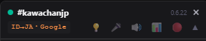
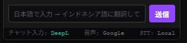
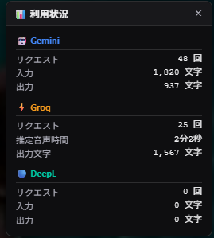

# Twitch Chat Translator

[日本語](README.md) | [English](README.en.md) | [Русский](README.ru.md)


📖 **Подробное руководство, FAQ и устранение неполадок доступны в [Wiki](https://github.com/KAWAchan-jp/twitch-chat-translate-ext/wiki)** (доступен обзор на английском)

**Chrome-расширение, которое убирает языковой барьер на Twitch**

> *«Sans Babel»* по-французски означает «без Вавилона».
> Согласно Книге Бытия, после строительства Вавилонской башни языки людей были смешаны, и так возник языковой барьер.
> Это расширение создано, чтобы убрать этот барьер.

| | |
|---|---|
| 💬 **Перевод чата в реальном времени** | Мгновенно переводит поток сообщений на японский, чтобы можно было наслаждаться зарубежными трансляциями вместе с чатом |
| 🎙️ **Субтитры речи стримера** | Автоматически распознает звук трансляции и показывает субтитры в реальном времени. API-ключ не нужен, обработка полностью локальная |
| ✏️ **Участие в чате на японском** | Пишите на японском, а расширение автоматически переведет и отправит сообщение, даже если стример говорит на другом языке |
| 🤖 **Перевод Gemini AI** | Использует Gemini AI для перевода голосовых субтитров и отправляемых сообщений. Хорошо передает игровые термины, сленг и естественную речь |
| 🖥️ **Faster-Whisper STT** | Запускает большие модели Whisper на GPU вашего ПК через локальный сервер: точное распознавание с низкой задержкой (требуется GPU) |
| ⚡ **Groq Whisper STT** | Облачное распознавание речи для быстрых и точных субтитров. В некоторых случаях распознает лучше локального Whisper |
| 🔊 **Озвучивание перевода (TTS)** | Автоматически зачитывает переведенные субтитры, чтобы можно было слушать и понимать стримера |
| 📊 **Панель использования API** | В реальном времени показывает расход Gemini, Groq и DeepL, помогая избежать лишнего использования |
| 🎬 **Запись клипов** | Записывает трансляцию и экспортирует видео с переведёнными субтитрами, которые можно вжечь через ffmpeg |

---

## Возможности

### Перевод чата

- **Перевод в реальном времени** — автоматически переводит сообщения по мере их появления через Google Translate или DeepL, с тремя параллельными обработчиками.
- **Режим быстрого чата** — если чат движется слишком быстро (3 сообщения/сек или больше), перевод автоматически ограничивается и показывается исходный текст. Остановите прокрутку или наведите курсор, чтобы переводить только видимую область и экономить API.
- **Отображение движка перевода** — в заголовке всегда показываются направление перевода и движок, например `JA→JA・Google`. Оранжевый цвет означает, что включены настройки для конкретного канала.
- **Индикаторы движков перевода в футере** — внизу панели в реальном времени показываются движок перевода ваших сообщений, движок перевода голосовых субтитров и движок STT. Щелчок переключает между включёнными движками.
- **Автоопределение языка трансляции** — получает язык из тегов Twitch и автоматически задает исходный язык.
- **Плавающая панель** — находится в правом нижнем углу страницы. Перетаскивайте заголовок, чтобы переместить панель, правый нижний маркер, чтобы изменить размер, и настройте прозрачность.
- **Автоопределение канала** — получает канал из URL и поддерживает SPA-навигацию Twitch.
- **Языковые настройки по каналам** — запоминает исходный и целевой языки для каждого канала и переключает их автоматически.
- **Пауза прокрутки** — при прокрутке вверх автопрокрутка останавливается и появляется кнопка «↓ Latest».
- **Кэш перевода** — одинаковый текст возвращается из кэша, что экономит лимит символов DeepL.
- **Перевод и отправка** — после входа в Twitch можно отправлять переведенные сообщения из поля ввода панели.
- **Фильтр минимальной длины** — пропускает короткие подколы и строки, похожие на эмоты. Порог символов можно менять.
- **Фильтр одинакового языка** — пропускает сообщения, уже написанные на целевом языке.

### Перевод Gemini AI

- **Выбор модели** — можно выбрать Gemini 2.5 Flash (рекомендуется), 3.1 Flash Lite, 3 Flash или 3.5 Flash.
- **Выбор по функциям** — Gemini можно отдельно включать и выключать для голосовых субтитров и отправляемых сообщений. Перевод чата остается на Google / DeepL, так как сообщений много и для них рекомендуется Google.
- **Редактирование промпта** — на странице настроек можно свободно настраивать промпт перевода. `{lang}` заменяется целевым языком, а `{text}` — распознанным текстом.
- **Fallback** — если Gemini отключен или произошла ошибка, расширение автоматически переключается по порядку: DeepL → Google Translate.
- **Бесплатный лимит** — 1 500 запросов/день и 15 запросов/минуту. API-ключ можно получить в Google AI Studio.

### Groq Whisper STT (опционально)

- **Облачное распознавание речи** — запускает Whisper Large-v3-Turbo / Large-v3 на высокоскоростной инфраструктуре Groq. В некоторых условиях может быть точнее локальной обработки.
- **Автоматический fallback** — если Groq завершился ошибкой или превышен лимит, расширение автоматически переключается на локальный Whisper.
- **Есть бесплатный лимит** — ежемесячный сброс, бесплатный план $0.00/месяц. После достижения лимита расширение продолжает работать через локальный Whisper.
- **Достаточно API-ключа** — чтобы включить функцию, достаточно ввести Groq API key на странице настроек.

> Groq API key можно бесплатно получить на [console.groq.com](https://console.groq.com).

### Faster-Whisper STT (локальный сервер, требуется GPU)

- **Точные модели на вашем ПК** — использует Faster-Whisper / CTranslate2 и запускает Large-v3 / Large-v3-Turbo на локальном сервере.
- **Распознавание вне браузера** — звук отправляется на локальный сервер, например `http://127.0.0.1:8765/transcribe`, а не обрабатывается внутри расширения Chrome.
- **Автоматический fallback** — если сервер не запущен, произошла ошибка или тайм-аут, расширение переключается на встроенный локальный Whisper.
- **Сервер в комплекте** — сервер на базе FastAPI находится в `tools/faster-whisper-server/`.

> Faster-Whisper — это не название модели, а движок, быстро выполняющий модели Whisper.
> На странице настроек он включается как движок STT, а модель (например, Large-v3-Turbo) выбирается отдельно.

#### Запуск сервера (GPU / CUDA)

Предполагается наличие NVIDIA GPU. **Устанавливать CUDA Toolkit не нужно** — если установлен
[uv](https://docs.astral.sh/uv/), достаточно одной команды
(pip-сборки cuBLAS / cuDNN скачиваются и подхватываются автоматически):

```powershell
cd tools\faster-whisper-server
uv run --with nvidia-cublas-cu12 --with "nvidia-cudnn-cu12>=9,<10" server.py
```

Если uv еще не установлен, сначала установите его:

```powershell
# Windows (PowerShell)
irm https://astral.sh/uv/install.ps1 | iex
```

```bash
# macOS / Linux
curl -LsSf https://astral.sh/uv/install.sh | sh
```

- Требования: NVIDIA GPU (рекомендуется от 4 ГБ VRAM) и драйвер с поддержкой CUDA 12 (версия 525 или новее).
- При первом запуске скачиваются cuBLAS / cuDNN (около 1,2 ГБ) и сама модель (Large-v3-Turbo — около 1,6 ГБ).
- Сервер готов, когда в консоли появится `Model '...' ready`.
- Без CUDA сервер автоматически переходит на CPU, но большие модели тогда превышают
  30-секундный тайм-аут расширения и непригодны для реального времени
  (замер на GPU: 7,5 с аудио распознаются примерно за 0,5–1 с).

#### Как использовать

1. Запустите сервер командой выше и дождитесь `Model '...' ready`.
2. На странице настроек расширения включите **Faster-Whisper**, выберите модель и сохраните
   (URL оставьте по умолчанию: `http://127.0.0.1:8765/transcribe`).
3. На странице Twitch убедитесь, что в футере панели показано **STT:** <span style="color:#c084fc">Faster</span>
   (щелчок переключает Local → Faster → Groq).
4. Запустите распознавание кнопкой 🎤 — субтитры теперь распознает сервер Faster-Whisper.

Подробности (переменные окружения, описание API, замеры производительности, запуск через venv)
см. в [tools/faster-whisper-server/README.md](tools/faster-whisper-server/README.md).

### Голосовые субтитры (локальный Whisper, требуется GPU)

- **API-ключ не нужен** — Whisper запускается локально внутри расширения с помощью Transformers.js v3 и ONNX Runtime.
- **Поддержка моделей, специализированных для японского** — Kotoba-Whisper v2.2, обычная и облегченная версии, заметно повышает точность распознавания японского.
- **Быстрое распознавание через WebGPU** — предполагается ПК с GPU; WebGPU используется автоматически. Без GPU расширение переходит на CPU (WASM), но с практичной скоростью работают только маленькие модели (tiny/base).
- **Без баннера общего доступа к вкладке** — звук берется напрямую из элемента `<video>` через Web Audio API. Распознавание работает даже при низкой громкости, но **при громкости 0 или выключенном звуке плеера захват становится беззвучным и ничего не распознается** (отключение звука вкладки браузера не мешает).
- **VAD (определение тишины)** — обработка начинается сразу после окончания речи, что снижает задержку.
- **Параллельная обработка воркерами** — несколько Web Worker выполняют распознавание одновременно (до 8 на CPU; 1 на GPU, чтобы не вызывать рывки видео).
- **Передача контекста** — последние фразы передаются как промпт, чтобы сохранять контекст распознавания.
- **Ручная загрузка моделей** — каждую модель можно отдельно скачать или удалить на странице настроек.
- **Защита от галлюцинаций** — автоматически удаляет характерные для Whisper повторы, аннотации тишины и шаблонные фразы. Можно добавить собственные шаблоны исключения.
- **Подсказки распознавания (два уровня)** — «подсказки по умолчанию» в настройках и временные подсказки панели 💡 повышают точность. Если поле пустое, автоматически используются имя стримера и название игры.
- **Оверлей субтитров** — показывает субтитры поверх трансляции. Окно можно перетаскивать.

### Озвучивание перевода (TTS)

- **Web Speech API** — зачитывает переведенный текст через встроенный в браузер движок синтеза речи.
- **Автоматический выбор голоса** — сначала выбирает нейронные голоса с естественным произношением, иначе использует стандартный голос того же языка.
- **Трехступенчатый fallback** — Natural/Online голос → голос того же языка → пропуск неподдерживаемых языков.
- **Настройка скорости** — скорость воспроизведения можно изменить на странице настроек (0.5x-2.0x).
- **Поддерживаемые языки** — японский, английский, корейский, китайский, испанский, французский, немецкий, португальский, русский, арабский, хинди, тайский, вьетнамский и индонезийский.

> В Windows 11 качество озвучивания улучшается после установки нейронных голосов, например Nanami или Keita.
> Их можно добавить через Settings → Time & language → Speech → Add voices.

### Запись клипов

- **Запись** — Записывает видео трансляции в формате WebM (максимальная длительность задаётся в настройках).
- **Экспорт субтитров ASS** — Автоматически создаёт файл `.ass` с распознанными и переведёнными субтитрами.
- **Стиль субтитров** — Настройка шрифта, размера, положения (X/Y) и фона (нет / светлый / средний / тёмный / непрозрачный) на странице настроек.
- **Генерация команды ffmpeg** — Автоматически формирует команду для вжигания субтитров (PowerShell, CMD или bash).

---

## Требования

- **Chrome** последней версии с поддержкой Manifest V3.
- **WebGPU**: для комфортного использования моделей Small и больше требуется GPU с поддержкой WebGPU.
  - RTX 20 серии или новее, RX 6000 серии или новее и т. п.
  - Без поддержки GPU расширение работает на CPU (WASM), но медленнее.
- **Доступная VRAM** при использовании GPU:

| Модель | Требуемая свободная VRAM |
|--------|--------------------------|
| Tiny / Base | Не требуется (рекомендуется CPU) |
| Small | 1 ГБ или больше |
| Kotoba-Whisper v2.2 облегченная | 1.5 ГБ или больше |
| Medium | 2 ГБ или больше |
| Large-v3-Turbo | 3 ГБ или больше |
| Kotoba-Whisper v2.2 | 3 ГБ или больше |

---

## Установка

1. Скачайте этот репозиторий ZIP-архивом или выполните `git clone`.
2. Откройте в Chrome `chrome://extensions/`.
3. Включите **Developer mode** в правом верхнем углу.
4. Нажмите **Load unpacked** и выберите скачанную папку.
5. Нажмите значок пазла (🧩) на панели инструментов и закрепите **Twitch Chat Translator**.

---

## Настройка (голосовые субтитры)

Перед использованием голосовых субтитров нужно скачать модель на странице настроек.

1. Щелкните правой кнопкой по значку расширения и откройте **Options**.
2. Нажмите **Download** у модели, которую хотите использовать.
3. Следите за индикатором загрузки и дождитесь завершения.
4. Когда появится «Downloaded ✓», подготовка завершена.
5. Откройте страницу Twitch и запустите распознавание кнопкой **🎤** на панели.

> **Примечание о первом запуске:** крупные модели, например Large-v3-Turbo, при первом запуске на странице Twitch компилируют GPU-шейдеры. Это может занять несколько минут. Сообщение «Initializing GPU shaders...» на панели является нормальным. Следующие запуски будут гораздо быстрее.

---

## Использование

### Заголовок панели



| Отображение | Описание |
|-------------|----------|
| ● Индикатор статуса | Состояние подключения к чату: зеленый = подключено, желтый мигающий = подключение, розовый = отключено/остановлено |
| **#имя_канала** | Подключенный канал. Справа также показывается текущая игра |
| **EN→JA・Google** | Направление и движок перевода. **Оранжевый** цвет означает сохраненные языковые настройки для канала |
| Число вроде 0.6.37 | Версия расширения |
| **💡** | Открывает/закрывает строку подсказок распознавания |
| **🎤** | Включает/выключает голосовые субтитры |
| **🔊** | Включает/выключает озвучивание перевода (TTS) |
| **📊** | Показывает/скрывает панель использования API |
| **🔴** | Открывает/закрывает панель записи клипов (мигает красным во время записи) |
| **×** | Закрывает панель и останавливает получение/перевод чата |

**💡 Строка подсказок распознавания**  
Здесь можно сразу редактировать подсказки, передаваемые Whisper. Добавьте собственные имена, названия персонажей или термины через пробел, чтобы повысить точность распознавания. Ввод сохраняется автоматически и применяется со следующей фразы. Когда тема меняется, подсказки удобно быстро заменить.

### Футер панели



В нижней части панели в реальном времени показываются текущие движки перевода.

| Отображение | Описание |
|-------------|----------|
| **Chat input:** | Движок перевода для сообщений, которые вы вводите и отправляете (Google / <span style="color:#00c4a0">DeepL</span> / <span style="color:#4285f4">Gemini</span>) |
| **Voice:** | Движок перевода для распознанной речи стримера (Google / <span style="color:#00c4a0">DeepL</span> / <span style="color:#4285f4">Gemini</span>) |
| **STT:** | Движок распознавания речи (Local = локальный Whisper / <span style="color:#c084fc">Faster</span> = Faster-Whisper / <span style="color:#f0971d">Groq</span> = Groq Whisper API) |

Изменения на странице настроек сразу отражаются в футере. **Щелчок по элементу футера переключает между включёнными движками** (ввод сообщений/голос: Google→DeepL→Gemini, STT: Local→Faster→Groq — невключённые в настройках движки пропускаются).

| Действие | Поведение |
|----------|-----------|
| Щелчок по значку | Показать/скрыть панель |
| Правый щелчок по значку | Изменить исходный/целевой язык и настройки отображения |
| Перетаскивание заголовка панели | Переместить панель |
| Перетаскивание правого нижнего маркера | Изменить размер панели |
| Прокрутка панели вверх | Приостановить автопрокрутку |
| Кнопка «↓ Latest» | Перейти вниз и возобновить автопрокрутку |

Языковые настройки сохраняются для каждого канала. При переходе на другой канал они переключаются автоматически.

### Панель использования



Это полупрозрачная плавающая панель, которая открывается кнопкой **📊** в заголовке. Она показывает использование Gemini, Groq и DeepL API в реальном времени.

| Элемент | Описание |
|---------|----------|
| **🤖 Gemini requests** | Количество запросов перевода |
| **🤖 Gemini input/output** | Количество отправленных и полученных символов |
| **⚡ Groq requests** | Количество запросов распознавания речи |
| **⚡ Groq estimated audio time** | Общая длительность распознанного аудио в секундах |
| **🔵 DeepL requests** | Количество запросов перевода |
| **🔵 DeepL input/output** | Количество отправленных и полученных символов |

Счетчики использования можно сбросить на странице настроек. Панель можно перетащить в любое место.

### Переключение движков перевода

Щелчок по любому элементу футера переключает включённые движки прямо из панели — открывать страницу настроек не нужно.

| Элемент футера | Движки при щелчке |
|---|---|
| **Chat input:** | Google → DeepL → Gemini (только включённые) |
| **Voice:** | Google → DeepL → Gemini (только включённые) |
| **STT:** | Local → Faster → Groq (Groq появляется при заданном API-ключе) |

> Чтобы движок появился в цикле, нужно задать API-ключ и включить его на странице настроек. Выключенные движки пропускаются.

### Отправка сообщений в чат

1. Щелкните правой кнопкой по значку и задайте исходный язык.
2. Нажмите **Log in with Twitch** на панели.
3. После входа введите сообщение на японском в нижнем поле панели и отправьте.
4. Сообщение будет автоматически переведено и опубликовано в канале.

### Голосовые субтитры

1. Нажмите кнопку **🎤** в заголовке панели.
2. Расширение автоматически распознает звук трансляции и показывает субтитры.
3. Окно субтитров можно перетащить в удобное место.

> Язык распознавания соответствует исходному языку в настройках канала. Если выбран `Auto detect`, Whisper определяет язык автоматически.

### Озвучивание перевода

1. Нажмите кнопку **🔊** в заголовке панели, чтобы включить озвучивание.
2. Когда речь стримера будет распознана и переведена, перевод автоматически будет зачитан.
3. Нажмите еще раз, чтобы остановить.

> Рекомендуется уменьшить громкость стримера или использовать наушники.

### Запись клипов

1. Нажмите кнопку **🔴** в заголовке панели, чтобы открыть панель записи.
2. Нажмите **«● Начать запись»**, чтобы начать запись (максимальная длительность задаётся в настройках; по умолчанию 3 минуты).
3. Во время записи кнопка 🔴 мигает красным и показывает прошедшее время.
4. Нажмите **«■ Стоп»**, чтобы завершить запись. Файл `clip_канал_дата.webm` скачивается автоматически.
5. Если в настройках включено «Добавлять субтитры к записи», файл субтитров `.ass` также скачивается автоматически.
6. Команда ffmpeg для вжигания субтитров в видео генерируется автоматически и копируется в буфер обмена.

> Субтитры записываются только когда активны голосовые субтитры **🎤**. Включите **🎤** перед началом записи.

---

## Модели Whisper

| Модель | Размер | Свободная VRAM | Точность | Рекомендуемая среда |
|--------|--------|----------------|----------|---------------------|
| Tiny | Около 38 МБ | Не требуется | Стандартная | CPU / слабые ПК |
| Base | Около 74 МБ | Не требуется | Выше | CPU |
| Small | Около 244 МБ | 1 ГБ+ | Высокая | Рекомендуется GPU |
| Medium | Около 769 МБ | 2 ГБ+ | Максимальная | Требуется GPU |
| Large-v3-Turbo | Около 809 МБ | 3 ГБ+ | Максимальная и быстрая | Требуется GPU |
| Kotoba-Whisper v2.2 ⭐ | Около 1.5 ГБ | 3 ГБ+ | Максимальная (для японского) | Требуется GPU; рекомендуется для японского |
| Kotoba-Whisper v2.2 облегченная ⭐ | Около 530 МБ | 1.5 ГБ+ | Высокая (для японского) | Рекомендуется GPU; ниже нагрузка; рекомендуется для японского |

> **Как выбрать модель:**  
> 1. Новичкам стоит начать с **Small**: легкая многоязычная универсальная модель.  
> 2. Если вы в основном смотрите японские трансляции, перейдите на **Kotoba-Whisper облегченная** для заметно лучшего распознавания японского.  
> 3. Если GPU нет, используйте **Tiny / Base** на CPU.

---

## Настройки

Откройте настройки через правый щелчок по значку расширения → **Options**.

| Настройка | Описание |
|-----------|----------|
| **Модель распознавания** | Загрузка, удаление и выбор моделей. Изменения применяются автоматически со следующей фразы |
| **Подсказки распознавания по умолчанию** | Постоянные подсказки для всех каналов. Они добавляются перед временными подсказками панели 💡 |
| **Размер шрифта субтитров** | Размер текста голосовых субтитров (14-56 px) |
| **Включить Faster-Whisper** | Распознавать речь через локальный сервер (GPU). Автоматически переключается на локальный Whisper, если сервер не запущен или произошла ошибка |
| **URL сервера Faster-Whisper** | Разрешены только `localhost` / `127.0.0.1`. По умолчанию: `http://127.0.0.1:8765/transcribe` |
| **Модель Faster-Whisper** | Выбор Small / Medium / Large-v3 / Large-v3-Turbo (рекомендуется) |
| **Включить Groq STT** | Распознавать речь через Groq Whisper API. При ошибке автоматически переключается на локальный Whisper |
| **Модель Groq** | Выбор Large-v3-Turbo (быстро) или Large-v3 (высокая точность) |
| **Groq API key** | Бесплатно получается на [console.groq.com](https://console.groq.com) |
| **Включить DeepL** | Использовать DeepL вместо Google Translate |
| **Выбор функций DeepL** | Отдельное включение DeepL для перевода чата, голосовых субтитров и отправляемых сообщений |
| **API-ключ DeepL** | Поддерживаются бесплатные ключи с окончанием `:fx` и платные ключи |
| **Включить Gemini** | Включает Gemini AI. Переключатели по функциям позволяют отдельно выбрать голосовые субтитры и отправляемые сообщения |
| **Модель Gemini** | 2.5 Flash (рекомендуется) / 3.1 Flash Lite / 3 Flash / 3.5 Flash |
| **API-ключ Gemini** | Получается в Google AI Studio. Бесплатный лимит: 1 500 запросов/день и 15 запросов/минуту |
| **Промпт Gemini** | Настройка инструкций перевода. `{lang}` = целевой язык, `{text}` = распознанный текст |
| **Скорость озвучивания перевода** | Скорость воспроизведения TTS (0.5x-2.0x) |
| **Целевой язык по умолчанию** | Целевой язык, если для канала нет отдельной настройки |
| **Фильтр одинакового языка** | Пропускать сообщения, уже написанные на целевом языке |
| **Фильтр минимальной длины** | Пропускать сообщения короче указанного числа символов |
| **Порог тишины VAD** | Чувствительность определения речи. Чем ниже значение, тем выше чувствительность. По умолчанию: 10% |
| **Длительность тишины VAD** | Ожидание от конца речи до начала обработки. По умолчанию: 500 мс |
| **Количество beams** | Баланс точности и скорости: 1 = быстрее, 3 = точнее |
| **Количество параллельных воркеров** | Число одновременных задач распознавания. По умолчанию: 4; при обнаружении GPU автоматически уменьшается до 1 |
| **Максимальная длина чанка** | Принудительная обработка, если тишина не обнаружена. По умолчанию: 5 секунд |
| **Прозрачность панели** | Прозрачность фона панели: 30-100%, по умолчанию 80%. При наведении панель становится непрозрачной |
| **Шаблоны исключения галлюцинаций** | Фразы ошибочной генерации Whisper, которые будут автоматически удаляться из субтитров |

> Бесплатный лимит DeepL составляет 500 000 символов в месяц. Бесплатный лимит Gemini — 1 500 запросов/день и 15 запросов/минуту. Включайте их только для нужных функций, чтобы экономить лимиты.

---

## Структура файлов

```text
twitch-chat-translate-ext/
├── manifest.json           # Настройки расширения (Manifest V3)
├── background.js           # Service Worker (прокси API перевода, кэш, OAuth)
├── content.js              # Главный content script (константы, состояние, инициализация, настройки)
├── content-panel.js        # Content script (панель Shadow DOM и UI)
├── content-chat.js         # Content script (IRC, перевод чата, режим быстрого чата)
├── content-whisper.js      # Content script (распознавание Whisper, субтитры, TTS)
├── whisper-worker.js       # Скрипт распознавания Whisper в Web Worker
├── auth-callback.js        # Content script для OAuth callback
├── help.html               # Страница помощи (правый щелчок по значку → “📖 Help”)
├── options.html / options.js / options.css
├── scripts/
│   ├── build-release.ps1                        # Скрипт создания release ZIP (расширение)
│   └── build-faster-whisper-server-release.ps1  # Скрипт создания release ZIP (сервер Faster-Whisper)
├── docs/images/            # Изображения для документации
├── lib/
│   ├── transformers.min.js                 # Transformers.js v3 (движок распознавания Whisper)
│   ├── ort-wasm-simd-threaded.jsep.wasm    # ONNX Runtime (поддержка WebGPU)
│   ├── ort-wasm-simd-threaded.jsep.mjs     # ONNX Runtime (поддержка WebGPU)
│   ├── ort-wasm-simd.wasm                  # ONNX Runtime WASM (поддержка SIMD)
│   └── ort-wasm.wasm                       # ONNX Runtime WASM (fallback)
├── icons/
└── tools/faster-whisper-server/  # Сервер Faster-Whisper STT (распространяется отдельно, Python)
    ├── server.py
    ├── requirements.txt
    └── README.md
```

---

## Технические детали

### Перевод

Прямые запросы `fetch` к `translate.googleapis.com` блокируются CORS, поэтому запросы идут из `content.js` через `background.js` (Service Worker).

Приоритет движков перевода: **Gemini → DeepL → Google**. Если включен более приоритетный движок, используется он, а при ошибке расширение автоматически переключается на следующий.
Перевод чата поддерживает только Google / DeepL, так как сообщений много и Gemini для этого не рекомендуется. Голосовые субтитры и отправляемые сообщения также могут использовать Gemini.
Результаты для одинаковых текстов и языковых пар сохраняются в LRU-кэше в памяти, чтобы не переводить их повторно.

### Получение и отправка чата

Расширение подключается напрямую к Twitch IRC через WebSocket: `wss://irc-ws.chat.twitch.tv:443`.

- Без входа: подключение только для чтения как анонимный пользователь `justinfan`.
- После входа: аутентификация OAuth-токеном и отправка сообщений командой `PRIVMSG`.

### Голосовые субтитры

**Захват:**  
Вместо `getDisplayMedia()` (общий доступ к вкладке с баннером) используется Web Audio API. Звук берется напрямую из элемента Twitch `<video>` через `AudioContext.createMediaElementSource(<video>)`.

**Распознавание (локально):**
[Transformers.js](https://github.com/huggingface/transformers.js) v3 + ONNX Runtime Web запускаются в Web Worker. При наличии GPU используются модели `onnx-community`, оптимизированные для WebGPU (fp16 encoder + q4 decoder; для облегченных моделей q4f16). Если GPU недоступен, расширение автоматически переключается на WASM-модели (q8 encoder + q4 decoder).

**Распознавание (Groq):**
Аудиоданные кодируются в Base64 и отправляются на `api.groq.com` через `background.js` (Service Worker).
Это обходит ограничения CORS и запускает Whisper Large-v3-Turbo / Large-v3 в облаке.
Если Groq завершился ошибкой, расширение автоматически переключается на локальный Whisper.

**Компиляция WebGPU-шейдеров:**  
При первом запуске ONNX Runtime компилирует GPU-шейдеры. Чем больше модель, тем дольше это занимает. Скомпилированные шейдеры кэшируются Chrome в IndexedDB, поэтому следующие запуски быстрее.

**VAD (Voice Activity Detection):**  
`AnalyserNode` отслеживает уровень громкости и запускает обработку, когда после речи продолжается заданный период тишины. Параллельные воркеры уменьшают задержку при непрерывной речи.

**Защита от галлюцинаций:**  
Характерные ошибки Whisper, включая шаблонные фразы, не-речевые аннотации, повторяющийся текст и вывод только из символов, автоматически обнаруживаются и удаляются.

### OAuth

Используется Twitch Implicit Grant flow.

1. Расширение открывает `id.twitch.tv/oauth2/authorize` в новой вкладке.
2. После аутентификации Twitch перенаправляет на `kawachan-jp.github.io/twitch-chat-translate/`.
3. `auth-callback.js`, внедренный на эту страницу, считывает токен из URL-фрагмента и передает его в `background.js`.

### Панель

Панель использует Shadow DOM, чтобы изолироваться от CSS страницы: `attachShadow({ mode: 'open' })`.
Панель использования находится в том же Shadow DOM, размещается отдельно через `position: fixed` и использует ту же настройку прозрачности, что и основная панель.

---

## Настройки по умолчанию

| Настройка | Значение по умолчанию |
|-----------|-----------------------|
| Исходный язык | Auto detect |
| Целевой язык | Japanese |
| Показывать исходный текст | ON |
| Автопрокрутка | ON |
| Faster-Whisper STT | OFF |
| Groq STT | OFF |
| Использовать DeepL | OFF |
| Использовать Gemini | OFF |
| Модель Gemini | 2.5 Flash |
| Озвучивание перевода (TTS) | OFF |
| Скорость TTS | 1.0x |
| Фильтр одинакового языка | OFF |
| Фильтр минимальной длины | OFF (4 символа) |
| Порог тишины VAD | 10% |
| Длительность тишины VAD | 500 мс |
| Количество beams | 1 (быстро) |
| Количество параллельных воркеров | 4 (1 при обнаружении GPU) |
| Максимальная длина чанка | 5 секунд |
| Модель Whisper | Tiny |
| Размер шрифта субтитров | 22 px |
| Прозрачность панели | 80% |

---

## Создание release ZIP

Для дистрибутивных ZIP используйте скрипты упаковки, а не ручное архивирование всего репозитория.
**Само расширение (для Chrome Web Store) и сервер Faster-Whisper (Python-инструмент) упаковываются
в отдельные ZIP-файлы.** ZIP расширения никогда не содержит файлов Python, поэтому его можно
отправлять на модерацию в Chrome Web Store как есть.

```powershell
# Расширение (twitch-chat-translator-vX.Y.Z.zip)
powershell -NoProfile -ExecutionPolicy Bypass -File scripts\build-release.ps1

# Сервер Faster-Whisper (faster-whisper-server.zip, распространяется отдельно от расширения)
powershell -NoProfile -ExecutionPolicy Bypass -File scripts\build-faster-whisper-server-release.ps1
```

Первый скрипт берет версию из `manifest.json` и создает `twitch-chat-translator-vX.Y.Z.zip`. Файлы разработки, такие как `.github/`, `.gitignore` и `CLAUDE.md`, не включаются в release ZIP.
Сервер Faster-Whisper — независимый инструмент без версионирования; второй скрипт упаковывает только
`server.py`, `requirements.txt` и `README.md` в `faster-whisper-server.zip`.

---

## Запросы функций и улучшения

Issues и pull requests приветствуются. Предлагайте функции, которые сделали бы расширение удобнее.

---

## Лицензия

[MIT License](LICENSE)
